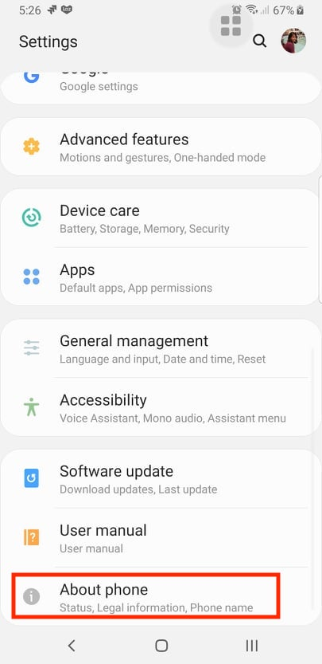
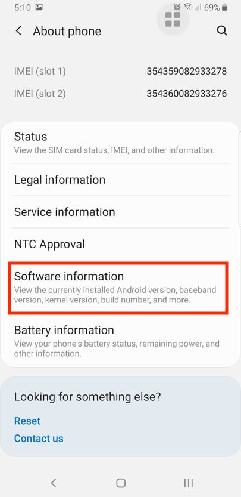
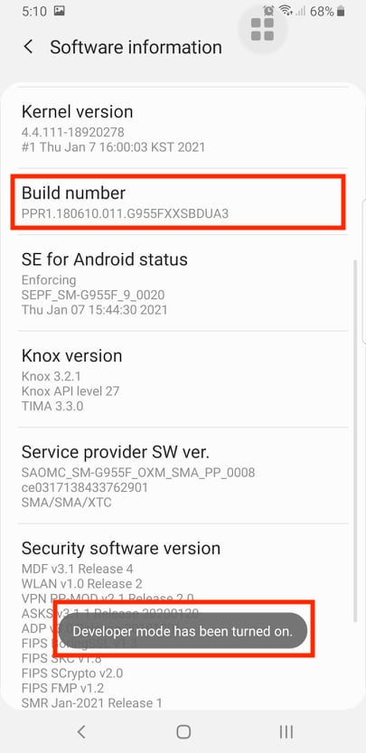
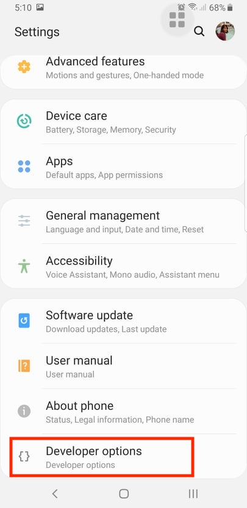
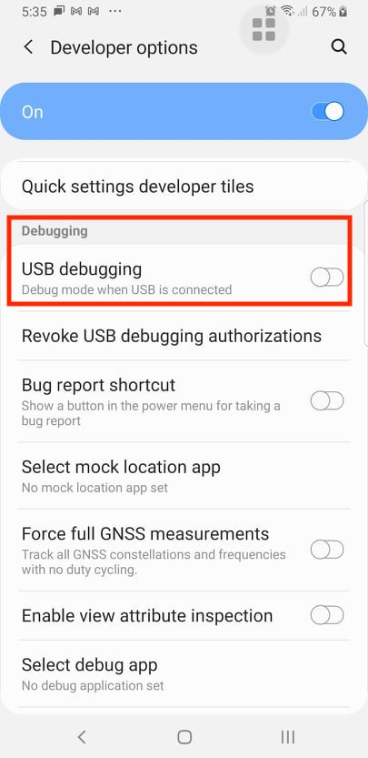
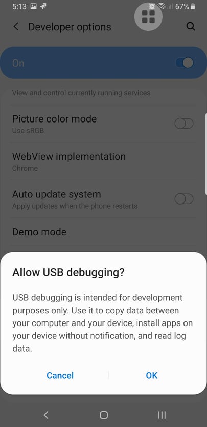
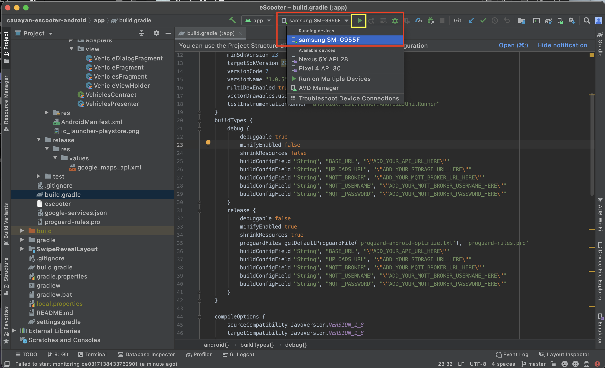
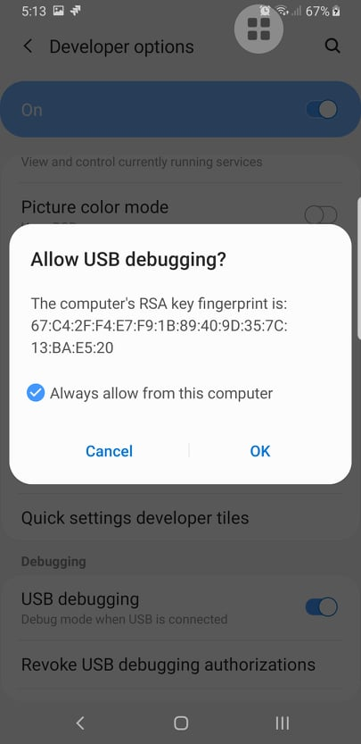

# Cauayan City eScooter Android App
Mobile app for Cauayan City eScooter.

## Setup Requirements
1. Download Android Studio from [here](https://developer.android.com/studio). Choose the appropriate installer for your operating system.

## Installation
1. Clone this repository.
```
git clone https://github.com/adapsense/cauayan-escooter-android.git
```

2. Open Android Studio.

3. Select `Open an Existing Project` and open `cauayan-escooter-android` folder.


4. Open app level [build.gradle](./app/build.gradle) and change values below with your server setup. 
 * ADD_YOUR_API_URL_HERE
 * ADD_YOUR_STORAGE_URL_HERE
 * ADD_YOUR_MQTT_BROKER_URL_HERE
 * ADD_YOUR_MQTT_BROKER_USERNAME_HERE
 * ADD_YOUR_MQTT_BROKER_PASSWORD_HERE


5. Open debug [google_maps_api.xml](./app/src/debug/res/values/google_maps_api.xml) and release [google_maps_api.xml](./app/src/release/res/values/google_maps_api.xml) and change the value of `ADD_YOUR_GOOGLE_MAPS_API_KEY_HERE` with your own Google Maps API key.

## Testing
1. In your Android device, enable developer mode by going to Settings > About phone > Software Information.
 

2. Click `Build number` multiple times until the message `Developer mode has been turned on`. Enter your device pin or pattern when prompted.


3. Go back to Settings. You should see Developer options below About phone.


4. Open Developer options and turn on `USB debugging`. Allow USB debugging when prompted.
 

5. Connect your Android device to your desktop computer or laptop running Android Studio using a USB cable. From the menu at the top select your Android device from the dropdown. Click the Play button to install the Android app into your phone.


6. Check your phone for a notification to Allow USB debugging. Select `Always allow from this computer` then click OK.

