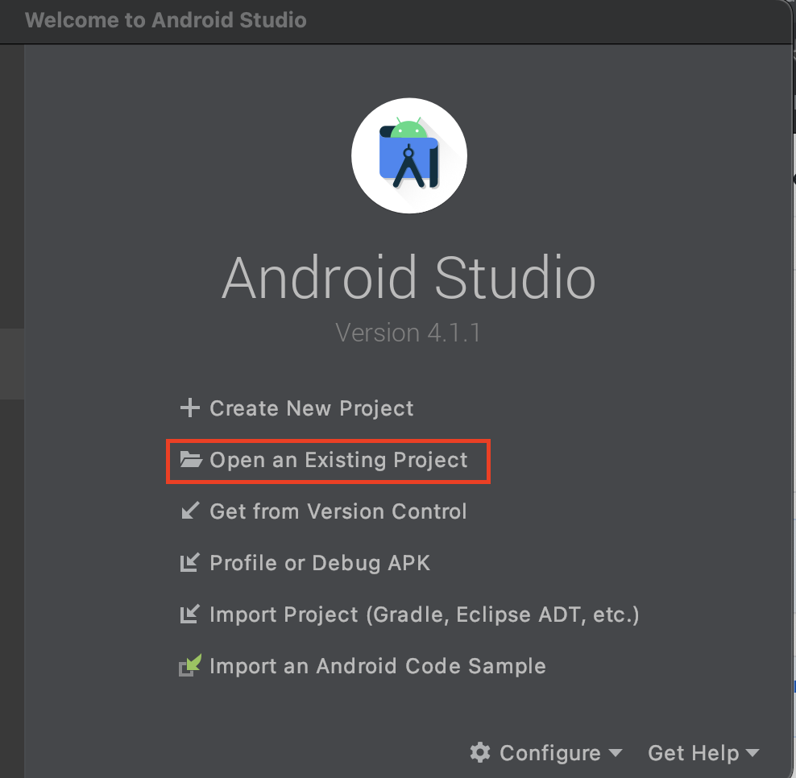
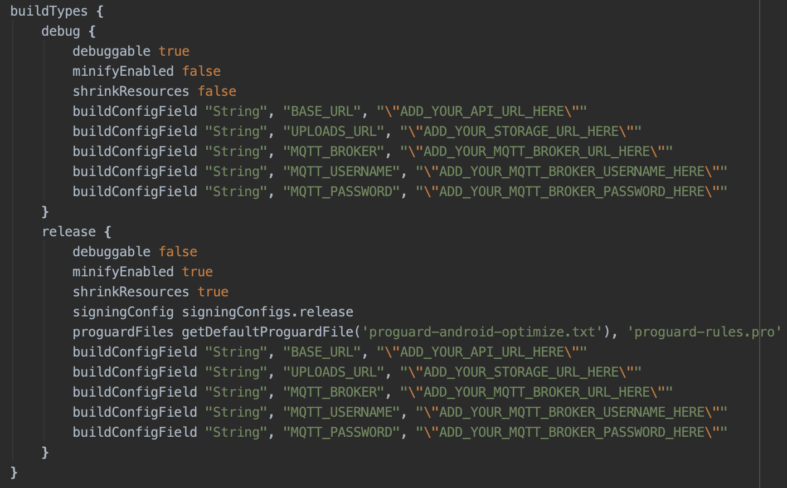

# Cauayan City eScooter Android App
Mobile app for Cauayan City eScooter.

## Setup Requirements
1. Download Android Studio from [here](https://developer.android.com/studio). Choose the appropriate installer for your operating system.

## Installation
1. Clone this repository.
```git clone https://github.com/adapsense/cauayan-escooter-android.git```
2. Open Android Studio.
3. Select `Open an Existing Project` and open `cauayan-escooter-android` folder.

4. Open app level [build.gradle](./app/build.gradle) and change values below with your server setup.
    * ADD_YOUR_API_URL_HERE
    * ADD_YOUR_STORAGE_URL_HERE
    * ADD_YOUR_MQTT_BROKER_URL_HERE
    * ADD_YOUR_MQTT_BROKER_USERNAME_HERE
    * ADD_YOUR_MQTT_BROKER_PASSWORD_HERE

5. Open debug [google_maps_api.xml](./app/src/debug/res/values/google_maps_api.xml) and release [google_maps_api.xml](./app/src/release/res/values/google_maps_api.xml) and change the value of `ADD_YOUR_GOOGLE_MAPS_API_KEY_HERE` with your own Google Maps API key.